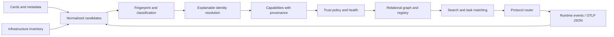

# Agent Census

**An executable research prototype for discovering what behaves like an AI agent—not just what has registered as one.** It correlates declared descriptions, infrastructure inventories and runtime evidence, then maintains an explainable registry and relationship graph.

It discovers a Security Agent, Research Agent and CV Agent; rejects a normal API, a plain MCP server, an LLM wrapper and a fixed workflow as agent positives; detects an unregistered shadow agent and a dynamically created sub-agent. A coordinator demonstrates delegation. All demonstration actions are synthetic and offline after dependency installation.

## Start with the reproducible demo

Requirements: Python **3.11+**, a terminal, and network access for the initial dependency installation. No Docker, cloud credentials, LLM account, GPU or external agent is required. Extract the ZIP and enter its single `agent-discovery-platform` directory.

```bash
python -m venv .venv
```

Activate it on Windows PowerShell:

```powershell
.\.venv\Scripts\Activate.ps1
```

Or on Linux/macOS:

```bash
source .venv/bin/activate
```

Install the hash-locked dependencies and this project:

```bash
python -m pip install --require-hashes -r requirements.lock
python -m pip install --no-deps -e .
python scripts/demo.py
```

The command starts real local HTTP mock peers, exercises the API, discovers and deduplicates entities, ingests runtime events, detects shadow agents, checks health, searches, matches and executes a synthetic task through A2A. It shuts down its peers and writes:

- `output/reports/demo-report.md`: readable result and measured evaluation.
- `output/reports/demo-report.json`: complete evidence and decision trail.
- `output/reports/evaluation.json`: measured synthetic metrics.

Run `python scripts/evaluate.py` to repeat the experiment. IDs, ports, timestamps and timings vary; classifications and ground-truth expectations are deterministic.

## Open the populated dashboard

Generate a local configuration file without printing credentials:

```bash
python scripts/init_env.py
```

This creates `.env` only if it does not exist. Load it into your shell using the next section, then run:

```bash
python scripts/serve_demo.py
```

Open **http://127.0.0.1:8000/** and paste the reader or admin token from your local `.env` into the password field. Tokens stay in page memory. The explorer shows capabilities, owner, protocol, health, confidence, last seen, original evidence, identity decisions and graph relationships. The shadow queue explains why review is recommended. Stop with Ctrl+C. This populated demo is ephemeral; restart rebuilds synthetic fixtures.

## Open the real-validation dashboard

To view real provider/runtime validation evidence, complete the Bedrock validation first, then serve its saved Census database:

```powershell
.\.venv\Scripts\python.exe scripts/real_validate.py
.\.venv\Scripts\python.exe scripts/serve_real_dashboard.py --port 8765
```

Open `http://127.0.0.1:8765/`. It starts with an empty inventory and zero counters; click **SCAN** to run configured real discovery sources and refresh stored runtime evidence. Select an entity to inspect its fingerprint and evidence, and use **Register Agent** on an unregistered agent to review and confirm identity resolution. The browser never prompts for or sends a Census token; the loopback-only backend handles admin authorization internally. This dashboard uses the real-validation database and does not seed synthetic entities. Do not expose it publicly. See [dashboard workflow and scan scope](docs/dashboard.md).

## Run the persistent API

For the integrated H2A application, run `npm.cmd run dev` from the parent workspace.
It starts this existing Census API on loopback port 8011 and H2A on 8787. The Census
process alone reads this project's `.env`, and a generated server-to-server token
connects H2A to `POST /agents/scan`. Integration state is separate from the offline
demo and historical validation databases. The launcher does not seed discovery
entities or execute model calls. See [the integration inspection](../docs/inspection-real-census.md).

Configure actual authorized discovery targets in this project's private `.env`
using `CENSUS_DISCOVERY_SOURCES` and `CENSUS_ALLOWED_ORIGINS`. An empty configuration
returns an explicit `no_sources_configured` warning and an empty inventory on a new
database. Runtime evidence arrives through the existing authenticated `/events`
or `/v1/traces` APIs. A2A declarations and MCP tool listings alone do not satisfy
the existing behavioral agent classifier.

Create `.env` with `python scripts/init_env.py`, then load it. PowerShell:

```powershell
Get-Content .env | ForEach-Object {
    if ($_ -match '^([A-Z_]+)=(.*)$') {
        [Environment]::SetEnvironmentVariable($matches[1], $matches[2], 'Process')
    }
}
```

Linux/macOS (the generated file contains only shell-safe values):

```bash
set -a
. ./.env
set +a
```

Start the single-worker service:

```bash
python -m uvicorn agent_census.api:create_app --factory --host 127.0.0.1 --port 8000
```

Open `/docs` for the OpenAPI UI or `/openapi.json` for its schema. Supply `Authorization: Bearer <your-token>` for all data endpoints. `/health`, `/ready`, dashboard shell and schema are public; no entity data is public. The generated default configuration uses `census.db` and denies every outbound target. Set `CENSUS_ALLOWED_ORIGINS` to explicit authorized origins; enable HTTP/private addresses only for controlled local peers. Never include credentials in URLs.

For containers, `docker compose up --build api` starts the SQLite service after `.env` initialization. PostgreSQL instructions and deployment boundaries are in [deployment.md](docs/deployment.md).

## What counts as an agent?

The first classifier is deterministic. It requires **LLM interaction + tool invocation + a planning/control signal + an execution-state signal**. A card or registration can strengthen an already behavioral positive; neither makes an entity an agent by itself. An MCP tool provider, isolated LLM wrapper, ordinary microservice or fixed workflow is not sufficient. An agent can also expose MCP. Unknown fields remain null or empty observations, and evidence scores are **not calibrated probabilities**.

Registration and agent classification are separate dimensions. A registered ordinary API stays a non-agent candidate. A behavioral positive lacking operator registration becomes a shadow review candidate. The system does not infer maliciousness from lack of registration. See [classification](docs/classification.md) and [shadow detection](docs/shadow-agent-detection.md).

## How it works



1. Independent adapters import safe metadata from explicitly configured sources. One failure returns a partial result and does not stop other sources.
2. Fingerprints retain observation sources and timestamps. Classification uses evidence categories rather than framework name matching.
3. Identity correlation uses exact normalized endpoints and scoped infrastructure signals; conflicting or ambiguous identities do not silently merge. Every accepted merge has reasons.
4. Capabilities distinguish **declared** skills, **observed** tool invocations, and **inferred** meanings from an explicit dictionary. Unsupported task meanings produce no match.
5. SQLAlchemy persists entities, observations, events, audit records, alerts and graph edges. SQLite is the default; PostgreSQL uses the same schema. Graph relationships include tools, capabilities, models, endpoints, owners, deployments and delegation. Unresolved delegation targets remain explicit.
6. Search explains evidence. Task matching requires all requested capabilities and filters by classification, operator approval, auth support, health and observation freshness. The router supports A2A, HTTP, MCP and explicitly installed local callables; it never retries task execution automatically.
7. A configurable monitor probes approved targets, expires stale evidence and refreshes graph/alerts. New discovery snapshots are submitted by your scheduled collector; this service does not enumerate your network automatically.

Read the [complete plain-language workflow](docs/workflow.md), [architecture](docs/architecture.md), and [seven editable diagrams](docs/diagrams/).

## API examples and extension points

Core endpoints include registration/list/detail/delete; `/discovery/run`; `/agents/scan`; capability search; evidence and graph views; `/events`; OTLP JSON `/v1/traces`; `/tasks/match`; `/tasks/route`; and `/reports/shadow-agents`. Compatibility aliases `/agents/discover` and `/discovery/scan` are included.

Use the JSON fixtures under `examples/` and source shapes in [discovery-sources.md](docs/discovery-sources.md). A registration request uses the `Candidate` schema shown in OpenAPI; clients cannot set trust, health, canonical IDs or registered status through discovery input. Only `POST /agents/register` grants registration. Only the separate admin trust endpoint grants approval.

To add a source, implement `DiscoveryAdapter._discover`, yield `Candidate` objects (or item failures), add an instance to `ADAPTERS`, and test a valid item and a failing item together. The service pipeline does not change. To add a local callable, call `app.state.router.register_local(name, handler)` in trusted application setup; HTTP callers cannot install code. See [protocol support](docs/protocols.md) for exact supported versions.

## Verify the project

```bash
python -m ruff format --check .
python -m ruff check .
python -m mypy src/agent_census
python -m pytest --cov=agent_census --cov-report=term-missing
python scripts/demo.py
```

Tests cover parsers, negative controls, fingerprints, identity conflicts, inference, auth, outbound policy, registry CRUD, event replay/expiry, partial discovery, graph, matching, all four routing adapters and the full demonstration. [Validation results](docs/validation.md) record checks actually performed on the delivered archive.

## Boundaries and future research

This is a production-oriented **prototype**, not a claim of production readiness. It is a single-process service with static role tokens and an in-process monitor. It does not validate cryptographic Agent Card signatures, operate a fleet collector, discover unseen agents without telemetry, inspect arbitrary processes/repos, or implement all A2A/MCP transports. A2A execution targets 0.3 JSON-RPC; MCP execution targets the 2025-11-25 sessionless JSON profile. Modern cards can be catalogued within the documented subset. OTLP support is an allowlisted JSON subset, not protobuf/gRPC ingestion. Public protocol traces can still be incomplete or spoofed by an authorized telemetry producer.

The measured fixture experiment is tiny and synthetic. It does not establish real-world precision, recall, trust or calibrated confidence. Future work includes labeled real traces, adversarial and temporal evaluations, signed workload identity, learned/calibrated classification, split/merge review, full protocol SDK integrations, scalable collection, database migrations beyond v1, and multi-process transaction coordination. See [research](docs/research.md), [evaluation](docs/evaluation.md), [security](docs/security.md) and [open-source inventory](docs/open-source-components.md).

Original project code is Apache-2.0. Dependencies retain their own licenses, included in `third_party/licenses`; no external implementation was copied wholesale.
